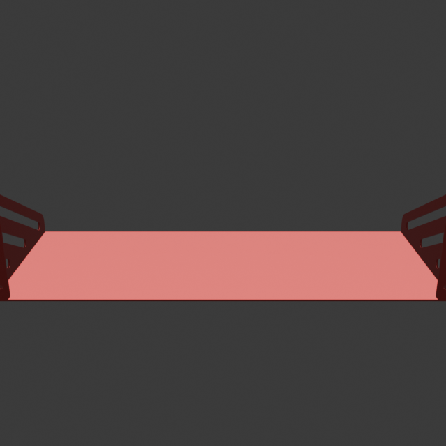
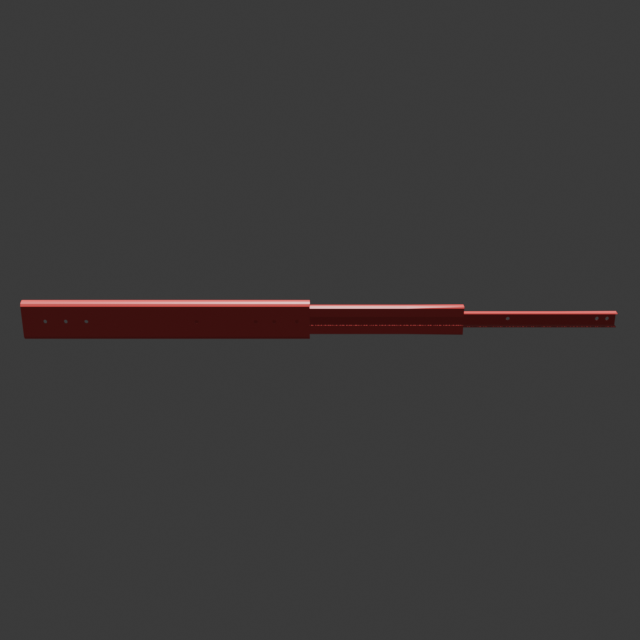
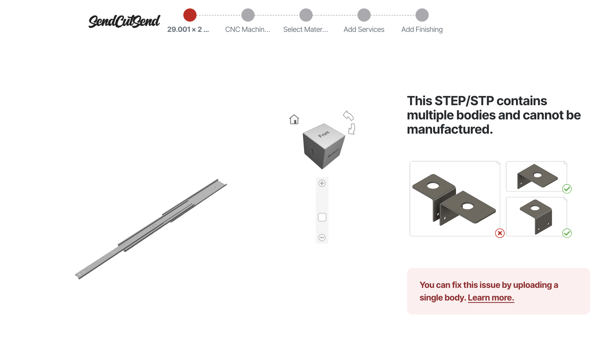

## Quickstart

```bash
source .venv/bin/activate
set -a && source .env.local && set +a
pip install -r requirements.txt

# Example: shelf (STL)
PYTHONPATH=$PWD python main.py --material aluminum --filepath models/shelf.STL

# Example: STEP (auto converts to STL→GLB)
PYTHONPATH=$PWD python main.py --material aluminum --filepath models/drawer_slide.step
```

Why this exists: why pay for a whole CAM stack just to get a number when you can… vibe it? We make the part cherry red so you can actually see it, attach geometry receipts (dims/volume/bodies), and ask an LLM for a price you can argue about.

## What this is
- We render 8 headless views in Blender, color the part red for contrast, feed images + exact metadata (dimensions, volume, bodies) to the model, and get a deterministic per-body quote.

## Shelf


Example output
```json
{
  "price_total_usd": 158,
  "overall_reasoning": "The model consists of a single shelf-like structure made from aluminum, with slotted sidewalls and a flat base. The dimensions and features suggest a fabrication process from a single sheet followed by bending and machining operations for the slots and mounting holes. The shape complexity is moderate, requiring multiple setups. The total cost accounts for material, laser/waterjet cutting, CNC machining for the slots and holes, bending operations, and finish.",
  "bodies": [
    {
      "name": "shelf.STL",
      "dimensions_mm": [
        614.91357421875,
        175.14306640625,
        260.05027866363525
      ],
      "volume_mm3": 567422.6556946455,
      "operations": [
        "CNC laser cutting (profile and slots)",
        "Press brake bending (two vertical sides)",
        "Deburring",
        "Surface finishing (anodizing or powder coat)"
      ],
      "machine_time_min": 42,
      "price_usd": 275,
      "reasoning": "The part is a one-piece design likely cut from a large aluminum sheet and then bent in two operations at the side brackets. Laser cutting is required for the complex outer profile, slots, and holes. Setup and cut time are high due to the size and the number of through-features. The large bends increase handling and fixture time, especially for thick-gauge aluminum. Finishing adds cost due to surface area. Total machine time is about 42 minutes including handling, with a material and process-driven price of $275 for a single unit."
    }
  ]
}
```

## Drawer Slide


Example output
```json
{
  "price_total_usd": 145.0,
  "overall_reasoning": "The part consists of a single, elongated body with complex shaped features resembling a rail or telescopic slide. It has a large length compared to its height and thickness, several mounting holes, and long precise cutouts. The body demonstrates both prismatic and channel-like features. The primary operations required include precision 2D profile cutting such as waterjet or laser cutting for the overall outline, 3-axis milling for slots/side features, and multi-position drilling for the mounting holes. Because of its length, fixturing and machine bed setup require additional time. Material is aluminum, making machining relatively fast, but size and number of features increase cost. A single part, with stepwise breakdown below.",
  "bodies": [
    {
      "name": "Created by Gmsh",
      "dimensions_mm": [
        736.5999908447266,
        50.79999923706055,
        12.699999809265137
      ],
      "volume_mm3": 97584.02038639584,
      "operations": [
        "Waterjet or laser cutting (profile and long cutouts)",
        "3-axis milling (side slots, steps, and partial channels)",
        "Drilling (multiple mounting and side holes)",
        "Deburring and surface finishing"
      ],
      "machine_time_min": 80,
      "price_usd": 145.0,
      "reasoning": "The length and thin profile require a long-bed CNC or large waterjet. After profile is cut, features such as slots and holes are machined in secondary ops; precision is needed for sliding fit and flatness, increasing time/cost. Estimated waterjet/laser (20 min), milling (45 min for slots, step-downs and complex cuts), drilling (10 min multi-position), finishing (5 min). Bulk of cost is in machine time, material size, and complex setup/fixturing. Aluminum helps mitigate cutting time, but size and precision drive up price."
    }
  ]
}
```

## Multipart? lol


SendCutSend choked on multipart uploads. Vibe cam doesn’t (sometimes). It can detect `body_count`, split metadata per body, and price each one deterministically (sometimes).

## Little story (why this works)
- First, we just rendered images. Everything was gray on gray. Hard to see. So we made the part bright red on a teal background.
- Then the model struggled with sizes. So we added exact metadata from the mesh: body_count, overall dimensions, per-body dimensions/volume/area/triangles.
- Finally, we told the model to be deterministic, break down per-body ops and machine time, and give an exact number.

## Supported inputs
- STEP/IGES (via Gmsh → STL → GLB), STL, OBJ, glTF/GLB